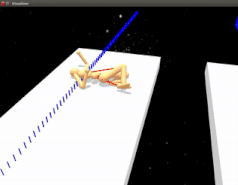
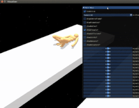
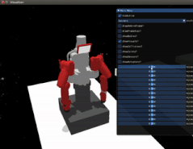
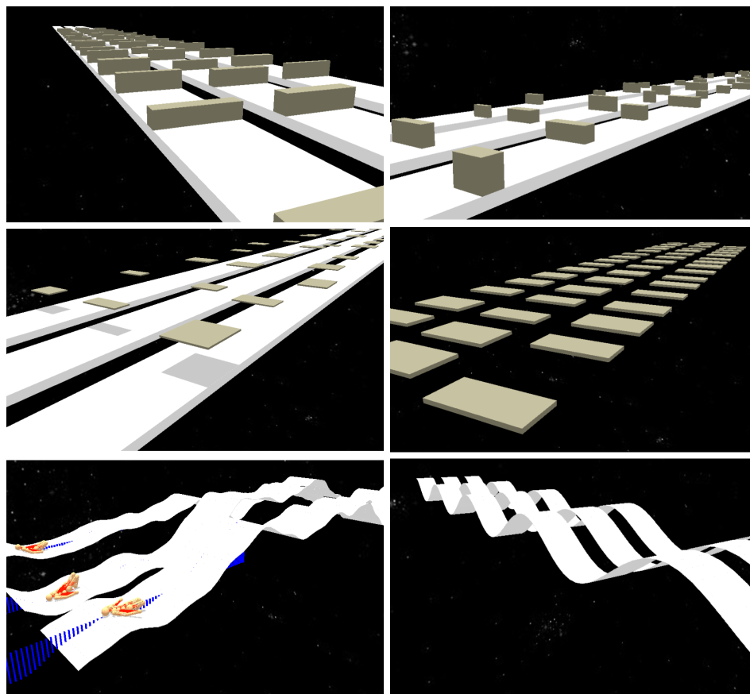
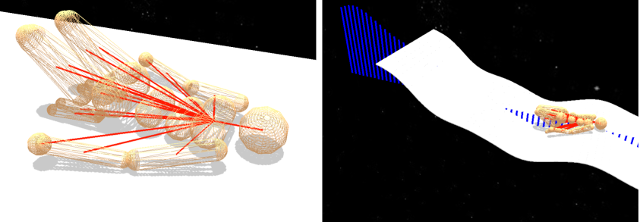
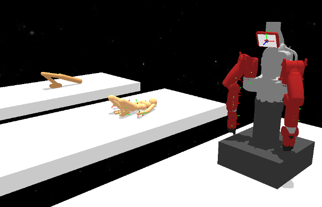

# tysocMjc :A C++ wrapper for mujoco, and some other stuff

  

## Objective

The main goal of this library is to serve as a framework for DeepRL research in locomotion. It's inspired in [dm_control](https://github.com/deepmind/dm_control), 
but I try to follow a different approach. This library is a concretion of an abstract framework for DeepRL, in the sense that most of the functionality is written 
in engine-agnostic dependencies (added in dev as submodules), and then making the necessary adapters to make it work with the specific physics engines (not porting 
everything again for every engine to be used). This is one specific concretion for the mujoco engine. I'm making the same for bullet and dart.

The abstract functionality should include these :

* **Terrain generation API** : abstract implementation of terrain generation for different environments (mainly procedural).
* **Model edition API** : abstract implementation of a model editor ( and environment editor if it fits in the design ).
* **Agent API** : abstract implementation of the necessary sensory information that an agent could need from the environment (terrain heightfield data, camera data, etc.) and itself (position/velocities of joints/bodies/etc respect to body/points/etc, etc.).

## Features

I'm currently working on this library and will be on heavy development for the next 8 months. The features will be updated in the corresponding dependency repos, and updated here as well. The updates will be documented in the [UPDATES.md](https://github.com/wpumacay/tysocMjc/blob/master/doc/UPDATES.md) file.

I will be adding more documentation as I develop the library, and sorry in advance as I might forget to update the docs from time to time. However, one main objective is to write comprehensive documentation, and I will be doing it on the go. If you have any suggestions/issues, just post an issue or contact me at wpumacay@gmail.com .

## Roadmap

The current roadmap and features being in my todolist can be found in [this](https://trello.com/b/pLkqprwU) trello board.