# Project Updates

## 12, nov, 2018

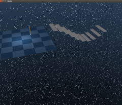

* Implemented base functionality to interact with mujoco objects. (ext/mjcint)

    1. Change body position
    2. Set actuator ctrls

* Implemented mjcf object handler (ext/mjcf)

    1. Allows to parse mjcf into basic object model
    2. Allows to create models using this basic object model

## 13, nov, 2018

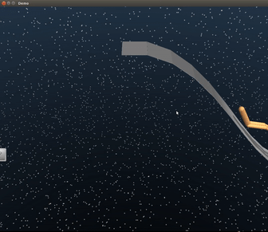

* Implemented base abstract terrain generation. (ext/tysocCore)

    1. implemented basic structure of the abstract terrain generation library
    2. implemented sections-type terraing generation

* Refactored repo and updated design

## 21, nov, 2018

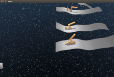

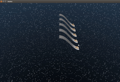

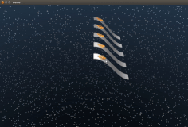

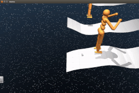

* Implemented framework :

    1. Implemented the full base framework and added wrappers for mujoco
    2. Added perlin noise generator
    3. Added walker and humanoid template

## 23, nov, 2018

* Integrated custom rendering engine into a decoupled visualizer : the visualizer is working and is decoupled of the concrete physics engine used. It updates its data from the underlying data being used by the abstract API, whose contents are written by the concrete implementations.

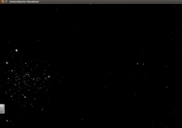

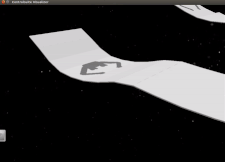

## 24, nov, 2018

* Added sensors (agent intrinsic and terrain extrinsic) to the library

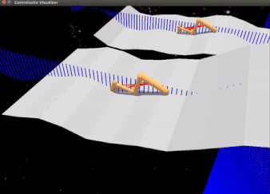

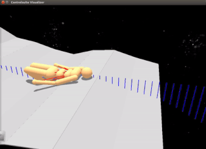

## 25, nov, 2018

* Added terrain generators to replicate the environments from [here](https://www.youtube.com/watch?v=hx_bgoTF7bs)

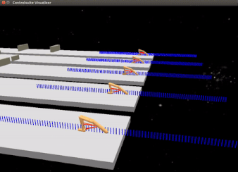

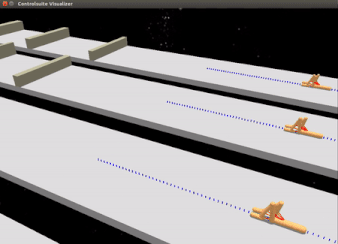

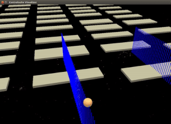

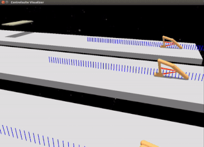

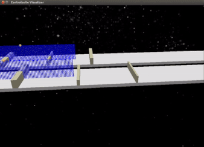

## 13, dic, 2018

* Made various changes after poster presentation :

    1. Implemented Kinematic tree agents
    2. Modified agent API
    3. Added small UI
    4. Fixed sensors for new agent API
    5. Refactored a bit

